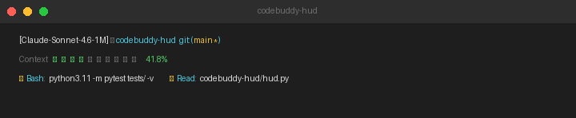

# codebuddy-hud

[](https://github.com/staryxchen/codebuddy-hud/actions/workflows/ci.yml)

A HUD-style status line for [CodeBuddy Code](https://cnb.cool/codebuddy/codebuddy-code), inspired by [claude-hud](https://github.com/jarrodwatts/claude-hud).



## What it shows

```
[Claude-Sonnet-4.6-1M] │ my-project  git:(main*)
Context ████░░░░░░ 41.8%
✓ Bash ×32  ✓ Read ×8  ✓ Edit ×5  ✓ WebFetch ×3  ✓ Grep ×2
```

| Field | Source |
|-------|--------|
| Model name | `model.display_name` from stdin |
| Folder name | `workspace.current_dir` from stdin |
| Git branch + dirty (`*`) | `git branch --show-current` |
| Context bar + % | `context_window.used_percentage` from stdin |
| Tool stats (Line 3) | Completed `function_call` entries in transcript, top 5 by count |

Context bar color: green < 70%, yellow 70–85%, red ≥ 85%.  
Line 3 shows the top 5 most-used tools this session; hidden when no tools have run.

## Installation

**One command:**

```bash
git clone https://github.com/staryxchen/codebuddy-hud ~/codebuddy-hud && bash ~/codebuddy-hud/install.sh
```

Then **restart CodeBuddy Code**.

The installer will:
1. Find a suitable Python 3.7+ in your PATH
2. Symlink `hud.py` into `~/.codebuddy/`
3. Merge the `statusLine` config into `~/.codebuddy/settings.json`

### Manual installation

If you prefer to do it by hand:

**1.** Clone this repo somewhere:
```bash
git clone https://github.com/staryxchen/codebuddy-hud ~/codebuddy-hud
```

**2.** Symlink the script:
```bash
ln -sf ~/codebuddy-hud/hud.py ~/.codebuddy/hud.py
```

**3.** Add to `~/.codebuddy/settings.json`:
```json
{
  "statusLine": {
    "type": "command",
    "command": "python3 ~/.codebuddy/hud.py",
    "padding": 0
  }
}
```

**4.** Restart CodeBuddy Code.

## Requirements

- Python 3.7+
- `git` in PATH
- `tail` in PATH
